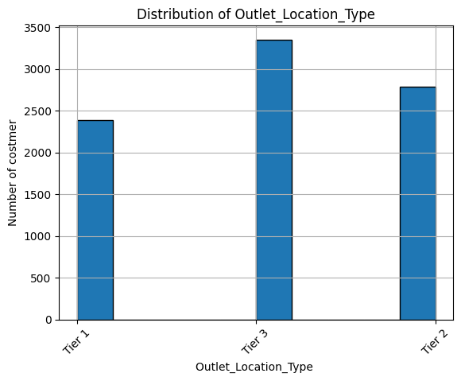

# Prediction-of-product-sales

## Sales prediction for food items sold at various stores. 

## The goal of this is to help the retailer understand the properties of products and outlets that play crucial roles in increasing sales.

##

 
# ** Projet 1**
# ** Lamia SAID**
# sales prediction for food items sold at various stores
# 1- Business problem:
The goal of this is to help the retailer understand the properties of products and outlets that play crucial roles in increasing sales.
# 2- Data:
the data using this link: download the data. (Note: Original data source).
# 3- Methods:
• Use Pandas to read the sales prediction data set into Google Colab.
• Use Python to treat the sales prediction data set into Google Colab.
# 4- Results:
 
Title: Distribution of Outlet Location Type vs Number of Custmer

# 5- Model:

Tier No. 3 is correlated with a large number of customers which means a high sales rate compared to the other tier1 and 2.
Recommendations:
To increase the sales rate of products in different supermarkets, you will have to put all the products on tier3.

# 6- Limitations & Next Steps:
We will continue to work on our sales prediction project. The goal of this is to help the retailer understand the properties of products and outlets that play crucial roles in increasing sales. The target is Item_Outlet_Sales to exploratory data visualization with Python.

# 7- For further information:
For any additional questions, please contact email :
Lamia_said2001@yahoo.fr

